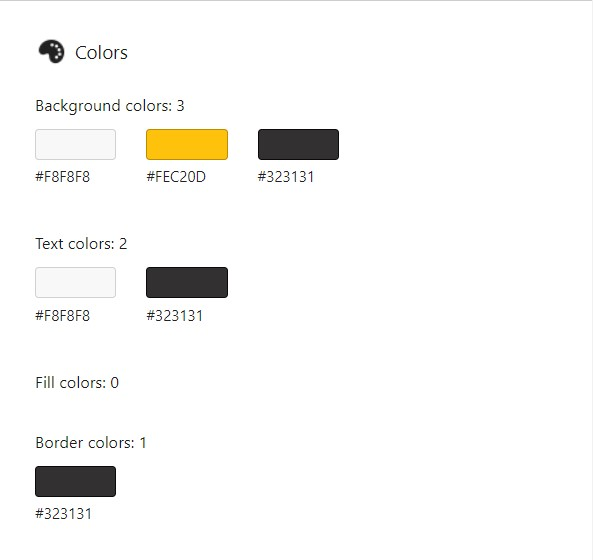

# About Me

## Name

Myke Melo!

## Description

About Me, is a project to demonstrate the knowledge HTML and CSS developing a web page. In the process of developing the web page I learnt various tags and rules of HTML and CSS along with best practices. This web page is outlined in three main sections. _Header section_, _Main content_ and _Footer section_. Main contents section is again divided into four portions. Biography, Photo gallery, Blog and Contact Form. Tried to incorporate a short biography and my hobbies with a photo gallery showing some images that I really like. Made changes to the color palette that was being used on the page to improve contrast for better visibility and accessibility. Also tried to simplify the use of colors to give the page a streamlined and professional look. Put a hover effect on image gallery to have a Zoom-out effect. I am very excited with CSS Animation and done some reading on this topic to write a content for the blog section of this page. I also added some examples showing the code samples along with a working example. To format the code sample beautifully I was also struggling as I wanted to put a nice-looking section of code examples for my readers to look. In search of that I came up with a very cool third-party library named [Prism JS](https://prismjs.com/index.html). I had experience using Google Fonts to decorate my webpage. With that experience I also incorporated Prism JS to my web page to display good looking code snippets. It was an interesting journey. I also made several last minutes changes to polish the page and also added hamburger menu for mobile display. Took help from a tutorial on YouTube to achieve that. Added Favicon on my page with the icon I got for this page. Used an online service to generate favicon and replaced my avatar with a photograph of myself. Finally added a fun touch to my photograph to make it colorful.

## Color Scheme

The web page was developed with minimal colors in mind. The whole page uses only 3 major colors to display all the contents. These colors are with HEX code `#F8F8F8`, `#FEC20D` and `#323131` or `rgb(248, 248, 248)`, `rgb(254, 194, 13)` and `rgb(50, 49, 49)` respectively.

### Background Colors

### Text Colors

### Border Colors

This is a screenshot of **CSS Overview** from Google Chrome DevTools that lists the colors being used by the page.

Here is also an example screenshot with the major colors being used.

## Citations

1. [How to add color to GitHub's README.md file](https://stackoverflow.com/a/70723478)
2. [Favicon Generator](https://realfavicongenerator.net/)
3. [CSS Animation on MDN](https://developer.mozilla.org/en-US/docs/Web/CSS/animation)
4. [Using CSS Animation](https://developer.mozilla.org/en-US/docs/web/css/css_animations/using_css_animations)
5. [CSS Animation Examples](https://www.creativebloq.com/inspiration/css-animation-examples)
6. [Browser Support](https://caniuse.com/css-animation)
7. [Prism JS Examples](https://prismjs.com/index.html#examples)

## License
Copyright (c) Myke Melo. All rights reserved.

Licensed under the [MIT License](blob/master/LICENSE).